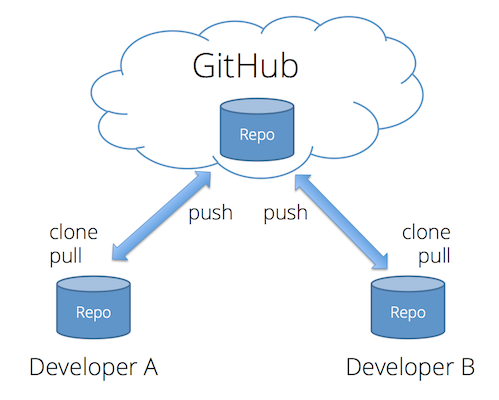

# Summary of the Third Session
**Date:** 1403,04,19 - 2024,07,09

### Github
- **Clone**: Copy the repository from GitHub to your local machine (Computer).
- **Push**: How to transfer files from your local repository to Github.
- **Pull**: Update the local repository to match the contents of the Github repository.
- **Commit**: Recording the changes in specific mode.
- **Conflict**: Happen when people make different changes to the same line of the same file, or when one person edits a file and another person deletes the same file.
