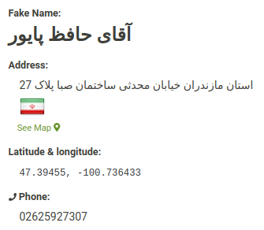
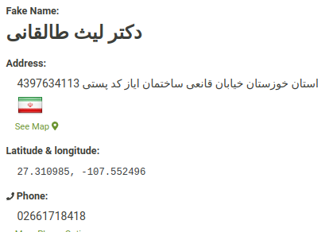

# Object School

## Things that I got help from to make the project:

### Card Profile Structure
[Css Card Profile](https://www.codingnepalweb.com/neumorphism-profile-card-html-css/)

### Tree Structure
[Tree 1](https://stackoverflow.com/questions/53151296/family-tree-with-pure-html-and-css-or-with-minimal-js)
[Tree 2](https://thecodeplayer.com/walkthrough/css3-family-tree)

### Fake Profile Information
[Iranian Fake ID](https://fauxid.com/fake-name-generator/iran)
- 
- 
- 
- 
- 
- 