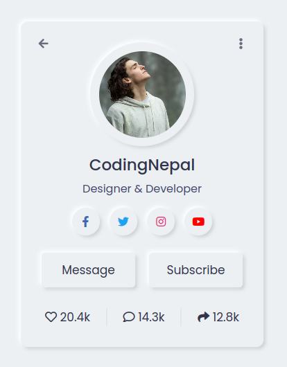

# Undefined
**Date-Start**: 1403,05,02 - 2024,07,23 
**Date-End**:  

## About Exercise
**Undefined**

## Reference - Things that I got help from to make the project
**Undefined**

### Card Profile Structure
 
[<a href="https://github.com/amirhossein-github/teacher-khateri/tree/main/course-exercises/course-1/session-4/reference/css-card-profile" target="_blank">Code</a>][[Ref](https://www.codingnepalweb.com/neumorphism-profile-card-html-css/)]

### Fake Profile Information [[Ref](https://fauxid.com/fake-name-generator/iran)]
<!-- 1 -->[[Img](https://github.com/amirhossein-github/teacher-khateri/blob/main/course-exercises/course-1/session-4/reference/fake-profile-information/1.png)]&nbsp;&nbsp;&nbsp;&nbsp;&nbsp;&nbsp;&nbsp;&nbsp;&nbsp;&nbsp;&nbsp;&nbsp;&nbsp;<!-- 2 -->[[Img](https://github.com/amirhossein-github/teacher-khateri/blob/main/course-exercises/course-1/session-4/reference/fake-profile-information/2.png)]&nbsp;&nbsp;&nbsp;&nbsp;&nbsp;&nbsp;&nbsp;&nbsp;&nbsp;&nbsp;&nbsp;&nbsp;&nbsp;&nbsp;&nbsp;<!-- 3 -->[[Img](https://github.com/amirhossein-github/teacher-khateri/blob/main/course-exercises/course-1/session-4/reference/fake-profile-information/3.png)]&nbsp;&nbsp;&nbsp;&nbsp;&nbsp;&nbsp;&nbsp;&nbsp;&nbsp;&nbsp;&nbsp;&nbsp;&nbsp;&nbsp;&nbsp;<!-- 4 -->[[Img](https://github.com/amirhossein-github/teacher-khateri/blob/main/course-exercises/course-1/session-4/reference/fake-profile-information/4.png)]&nbsp;&nbsp;&nbsp;&nbsp;&nbsp;&nbsp;&nbsp;&nbsp;&nbsp;&nbsp;&nbsp;&nbsp;&nbsp;&nbsp;&nbsp;<!-- 5 -->[[Img](https://github.com/amirhossein-github/teacher-khateri/blob/main/course-exercises/course-1/session-4/reference/fake-profile-information/5.png)]&nbsp;&nbsp;&nbsp;&nbsp;&nbsp;&nbsp;&nbsp;&nbsp;&nbsp;&nbsp;&nbsp;&nbsp;&nbsp;&nbsp;&nbsp;<!-- 6 -->[[Img](https://github.com/amirhossein-github/teacher-khateri/blob/main/course-exercises/course-1/session-4/reference/fake-profile-information/6.png)]

### Student Profile Images [[Ref](https://www.freepik.com/)]
 <!-- 1 -->[[Ref](https://www.freepik.com/free-photo/modern-woman-holding-laptop-medium-shot_6185630.htm#fromView=search&page=3&position=16&uuid=ce7da349-64cb-4361-95e0-9c20f499d941)][[Img](https://github.com/amirhossein-github/teacher-khateri/blob/main/course-exercises/course-1/session-4/reference/studnet-profile-images/modern-woman-holding-laptop-medium-shot.jpg)]&nbsp;&nbsp;&nbsp;&nbsp;&nbsp;&nbsp;&nbsp;<!-- 2 -->[[Ref](https://www.freepik.com/free-photo/portrait-handsome-student-smiling_8919118.htm#fromView=search&page=1&position=2&uuid=ce7da349-64cb-4361-95e0-9c20f499d941)][[Img](https://github.com/amirhossein-github/teacher-khateri/blob/main/course-exercises/course-1/session-4/reference/studnet-profile-images/portrait-handsome-student-smiling.jpg)]&nbsp;&nbsp;&nbsp;&nbsp;&nbsp;&nbsp;&nbsp;<!-- 3 -->[[Ref](https://www.freepik.com/free-photo/tourism-travelling-young-redhead-woman-smiling-tourist-walking-with-backpack-around-city-centre_38795533.htm#fromView=search&page=1&position=1&uuid=b8dc9881-c9d8-4777-84b9-f60b603f6377)][[Img](https://github.com/amirhossein-github/teacher-khateri/blob/main/course-exercises/course-1/session-4/reference/studnet-profile-images/tourism-travelling-young-redhead-woman-smiling-tourist-walking-with-backpack-around-city-centre.jpg)]&nbsp;&nbsp;&nbsp;&nbsp;&nbsp;&nbsp;&nbsp;<!-- 4 -->[[Ref](https://www.freepik.com/free-photo/young-teen-boy-keeping-hands-back-checked-shirt-looking-confident-front-view_17410869.htm#fromView=search&page=1&position=42&uuid=ce7da349-64cb-4361-95e0-9c20f499d941)][[Img](https://github.com/amirhossein-github/teacher-khateri/blob/main/course-exercises/course-1/session-4/reference/studnet-profile-images/young-teen-boy-keeping-hands-back-checked-shirt-looking-confident-front-view.jpg)]&nbsp;&nbsp;&nbsp;&nbsp;&nbsp;&nbsp;&nbsp;<!-- 5 -->[[Ref](https://www.freepik.com/free-photo/female-student-holding-files-copybooks-white_11310301.htm#fromView=search&page=1&position=36&uuid=ef911e35-5f8a-45fe-83e0-4e7bc7c21b85)][[Img](https://github.com/amirhossein-github/teacher-khateri/blob/main/course-exercises/course-1/session-4/reference/studnet-profile-images/female-student-holding-files-copybooks-white.jpg)]&nbsp;&nbsp;&nbsp;&nbsp;&nbsp;&nbsp;&nbsp;<!-- 6 -->[[Ref](https://www.freepik.com/free-photo/portrait-teenage-boy_4142571.htm#fromView=search&page=3&position=45&uuid=ce7da349-64cb-4361-95e0-9c20f499d941)][[Img](https://github.com/amirhossein-github/teacher-khateri/blob/main/course-exercises/course-1/session-4/reference/studnet-profile-images/portrait-teenage-boy.jpg)]