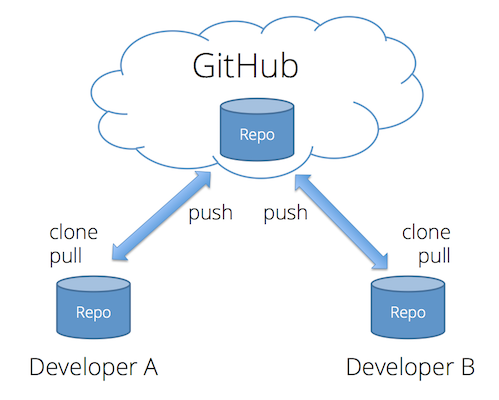

# Summary of the Third Session
**Date:** 1403,04,19 - 2024,07,09

## Github
- **Clone**: Copy the repository from GitHub to your local machine (Computer).
- **Push**: How to transfer files from your local repository to Github.
- **Pull**: Update the local repository to match the contents of the Github repository.
- **Commit**: Recording the changes in specific mode.
- **Conflict**: Happen when people make different changes to the same line of the same file, or when one person edits a file and another person deletes the same file.<br>


## VS Code
**Word Wrap**: `ALT + z`<br>
**Trigger IntelliSense**: `CTRL + space`<br>
**Comment**: `CTRL + /`<br>

## Definitions and tips
- **Script**: A piece of code that serves a purpose.
- **Console**: In Inspect, there is a section called console which helps us to know if our javascript code has encountered a problem during execution or not. The texts that are usually displayed in the console include the requested text, **errors**, **warnings**, and **information**. The most important of all of them are the errors that, if not managed correctly, cause the code to stop running. We can also communicate with the console using the `console.METHOD()` command in JavaScript.
- **Low and High Programming Language**: High-level languages ​​have a more natural and readable syntax and are closer to human language that makes it easier for programmers to read and understand the code. (Javascript, Php, Python, ...) Low-level languages ​​require more coding and debugging, which increases development time because they are closer to computer and machine languages. (Assembly, 01, ...)
- **Method**: One of the signs of the method is that it prates comes after its name Like: `console.log(), alert(), console.error()`. Methods are like tools in a toolbox, each of which does something for us. Some of them are already defined, some of them we make ourselves.
- **Compiler and Interpreter**: Interpreter: they execute the code line by line. And if they encounter an error, they stop the execution. (Javascript, Python, Ruby, ...) Compiler: First, they run all the code, if there is no error, they give you an output, and then you can use that output. (C, C++, C#, Java, Swift, ...)<br>
In Interpreter mode we can apply changes and get output quickly and see the result. And with tricks, it is possible to prevent stopping the program from errors completely.

## Javascript
> [!IMPORTANT]
> To add JavaScript codes to the HTML file, we should not put it directly with the script tag, but in a separate file and then connect it to the HTML file. Like we used to do it for CSS.
### Variable
**Syntax**: `Keyword (var, const)` + `Variable Name` + `=` + `Value`<br>
Some example of variable in javascript
```js
const google = 'https://google.com' // string
var randomNumber = 423434321        // int
const myName = 'Amirhossein'        // string
var course = 'Javascript'           // string
var male = true                     // boolean
const female = false                // boolean
var avrage = 23.5                   // float
```
> [!WARNING]
> If we use the `const` keyword, we can't change the value of changes, and if we do this, we will get an error, but if we use the `var` keyword, we can change its value later.

To see what a variable type is, we can use the following command.
```js
const color = 'red'
console.log(typeof color)
// string
```
---

# My Further Research During the Course

<details><summary>Console.METHOD()</summary>
  
```js
// Clear
console.clear()

// Print
console.log('log')
console.info('info')
console.warn('warn')
console.error('error')
console.debug('debug')
//----------
console.group()
console.groupCollapsed()
console.groupEnd()
console.groupEnd()

// Count
console.count()
console.countReset()

// If
console.assert()

// Tree
console.dir()
console.dirxml()

// Table
console.table(["apples", "oranges", "bananas"]);

// Time
console.time('lol')
console.timeLog('lol')
console.timeStamp('lol') 
console.timeEnd('lol')

// Trace
console.trace()

// ?
console.profile()
console.profileEnd()
// %o %O %s %i , ...
// Styled output use %c
```

</details>

<details><summary>How to Make JavaScript Code Harder to Read</summary>

1. Obfuscate the javascript code
    - change the variable name
2. Server Side Rendering
    - sensitive code -> server side
    - sensitive information -> server side
3. Javascript minification
    - removing unnecessary characters
4. Disabling the right mouse click


</details>

<details><summary>What is the TypeScript</summary>

A superset is a language that includes all of the features of another language, as well as additional features. For example, Kotlin is a superset of Java, C++ is (mostly) a superset of C.

TypeScript is referred to as an Object-oriented programming language; on the other hand, JavaScript is a prototype-based language.

Prototype-based programming is a style of object-oriented programming in which classes are not explicitly defined, but rather derived by adding properties and methods to an instance of another class or, less frequently, adding them to an empty object.

TypeScript offers static types mean variables, objects, and functions, whereas JavaScript doesn't require the explicit declaration of the variables before they're used

</details>

<details><summary>Datatype and Variables</summary>

### Var, Const, Let
**var**: Declares a variable, optionally initializing it to a value.<br>
**let**: Declares a block-scoped, local variable, optionally initializing it to a value.<br>
**const**: Declares a block-scoped, read-only named constant.<br>

### null, undefined, boolean, number, bigint, string, symbol

#### Symbol
```js
let sym2 = Symbol('foo')
let sym3 = Symbol('foo')
Symbol('foo') === Symbol('foo')  // false
```

But what's the point ???

#### null and undefined
undefined means a variable has been declared but has not yet been assigned a value, whereas null is an assignment value, meaning that a variable has been declared and given the value of null .

#### boolean
true, false

#### number 
```js
255; // two-hundred and fifty-five
255.0; // same number
255 === 255.0; // true
255 === 0xff; // true (hexadecimal notation)
255 === 0b11111111; // true (binary notation)
255 === 0.255e3; // true (decimal exponential notation)
```

#### bigint
too large number
```js
const previouslyMaxSafeInteger = 9007199254740991n;
const alsoHuge = BigInt(9007199254740991);
// 9007199254740991n
const hugeString = BigInt("9007199254740991");
// 9007199254740991n
const hugeHex = BigInt("0x1fffffffffffff");
// 9007199254740991n
const hugeOctal = BigInt("0o377777777777777777");
// 9007199254740991n
const hugeBin = BigInt(
  "0b11111111111111111111111111111111111111111111111111111",
);
// 9007199254740991n
```

#### string
Like Always

</details>