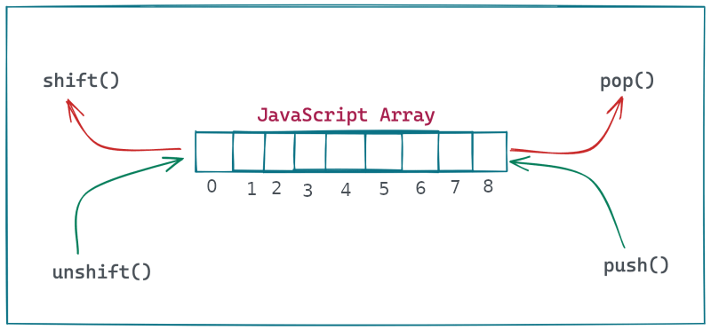

# Summary of the Seventh Session
**Date:** 1403,05,07- 2024,07,28

## Data Structure Stack and Queue


**Stack**:
- Example of Method: `pop()`, `push()`
- LIFO last in first out

**Queue**: 
- Example of Method: `unshift()`, `shift()`
- FIFO first in first out


## Algorithm and Flowchart
An algorithm is a step-by-step summary of the procedure, while on the other hand, a flowchart illustrates the steps of a program graphically.

**Oval**: For start and end.<br>
**Rectangle**: For process.<br>
**Parallelogram**: For  input and output.<br>
**Rhombus**:‌ For if and conditional commands.<br>

Example (1): Write an algorithm that receives two numbers and then adds them and finally displays them.
1. Define **variable A** and save it in memory.
2. Define **variable B** and save it in memory.
2. Define variable sum and save it in memory.
3. Get the **first** value from the user and store it in **variable A**.
4. Get the **second** value from the user and store it in **variable B**.
5. Do this operation: `sum = A + B`
6. Display the `sum` variable.

> [!TIP]
> Each part of a flowchart is a part of the process of that program

## If and Operators
### Syntax
```js
if ( Condition ) {
    // Code
    // Code
    // Code
}
```

### Operators
**=**: It is used to assign a value to a variable. - `let a = 20`<br>
**==**: It is used to show equality. - `console.log(20 == 21) // False`<br>
**===**: It is used for equal value and data type. - ‍`console.log('20' === '20') // True`<br>
**!=**: The opposite of equality works. - `console.log(12 != 12) // True`<br>
**!==**: The opposite of === works. - ‍`console.log('20' !== 20) // True`<br>
**>**: It means that if it was more than this amount. - `console.log( 10 > 5 ) // True`<br>
**<**: It means that if it was less than this amount. - `console.log( 10 < 5 ) // False`<br>
**>=**: It means that if it was more and equal than this amount. - `console.log( 5 >= 9 ) // False`<br>
**<=**: It means that if it was less and equal than this amount. - `console.log( 10 <= 11 ) // True`<br>
**\***: It is used to multiply. - `console.log( 100 * 2 ) // 200`<br>
**/**: It is used to division. - `console.log( 100 / 2 ) // 50`<br>
**+**: It is used to subtraction. - `console.log( 100 - 2 ) // 98`<br>
**-**: It is used to adding. - `console.log( 100 + 2 ) // 102`<br>