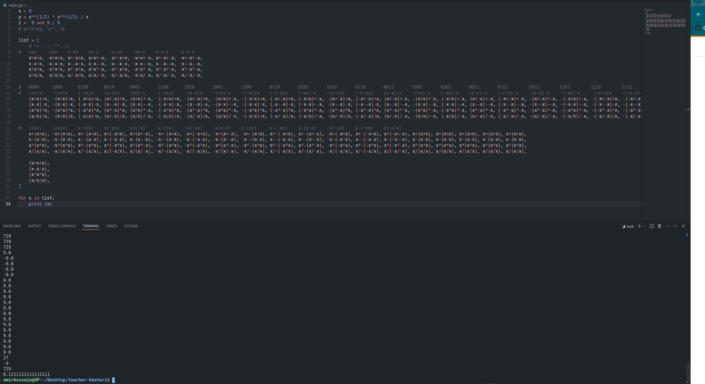
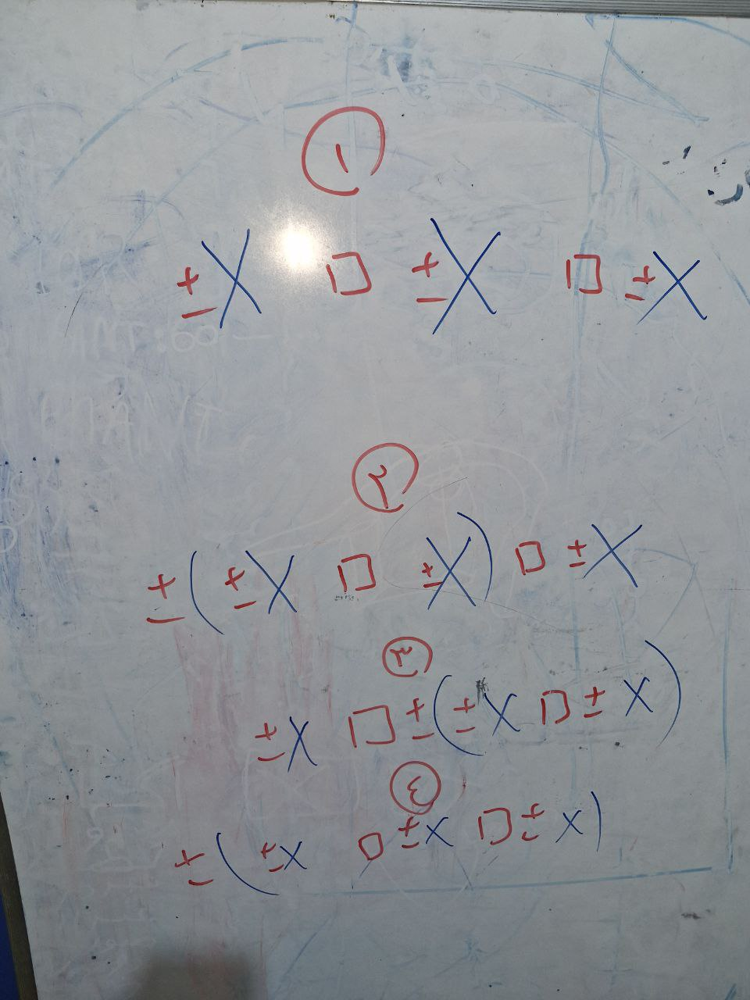
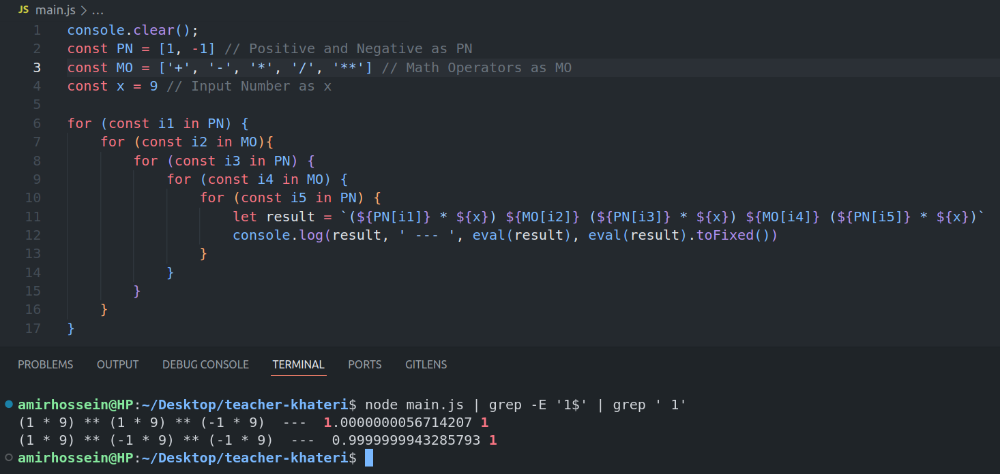
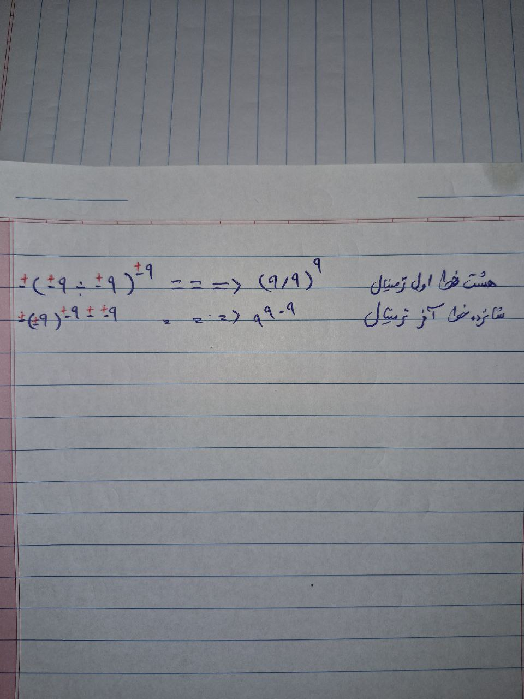

# Solve a Numeric Puzzle: 9 9 9 = 1
**Description**: To solve this puzzle, you have to put 3 numbers 9 between the mathematical operators so that the final answer is one.<br>
This project was supposed to be solved manually and like a simple puzzle, although some friends used artificial intelligence to solve the challenge, but it occurred to me to solve this puzzle by using a programming language, whether Python or JavaScript.
```js
9 _ 9 _ 9 = 1 // How?
```
## Answer

#### Some seemingly correct but wrong answers
```js
1. ( 9 - 9 ) ** 9
2. ( 9 ** ( 1 / 2 )) * ( 9 ** ( 1 / 2 )) / 9
3. 9 && 9 / 9
4. ( 9 ** 0 ) * 9 / 9

// Correct answers
5. 9 ** 9 - 9
6. (9 / 9) 9
```

#### My Answer
```js
// File: app.js
console.clear();
const PN = [1, -1] // Positive and Negative as PN
const MO = ['+', '-', '*', '/', '**'] // Math Operators as MO
const x = 9 // Input Number as x

for (const i1 in PN){
    for (const i2 in PN){
        for (const i3 in PN){
            for (const i4 in PN){
                for (const i5 in MO){
                    for (const i6 in MO){
                            // +-1 * ((+-1 * x) MO (+-1 * x)) MO (+-1 *  x)  ---> (x _ x) _ x
                            let model_1 = `${PN[i1]} * ( (${PN[i2]} * ${x}) ${MO[i5]} (${PN[i3]} *  ${x}) ) ${MO[i6]} (${PN[i4]} * ${x})`

                            // +-1 * x MO (+-1 * ((+-1 * x) MO (+-1 * x))) ---> x _ (x _ x)
                            let model_2 = `(${PN[i2]} * ${x}) ${MO[i5]} ( ${PN[i1]} * ( (${PN[i3]} *  ${x}) ${MO[i6]} (${PN[i4]} * ${x})))`

                            // +-1 * ((+-1 * x) MO (+-1 * x) MO (+-1 * x)) ---> (x _ x _ x)
                            let model_3 = `${PN[i1]} * ( (${PN[i2]} * ${x}) ${MO[i5]} (${PN[i3]} *  ${x}) ${MO[i6]} (${PN[i4]} * ${x}))`

                            // (+-1 * x) MO (+-1 * x) MO (+-1 * x) ---> x _ x _ x
                            let model_4 = `(${PN[i1]} * ${x}) ${MO[i5]} (${PN[i2]} * ${x}) ${MO[i6]} (${PN[i3]} * ${x})`

                            // Show the result
                            console.log(model_1, ' === ', eval(model_1))
                            console.log(model_2, ' === ', eval(model_2))
                            console.log(model_3, ' === ', eval(model_3))
                            console.log(model_4, ' === ', eval(model_4))
}}}}}}

// Bash Terminal
const terminalCommand = "clear; node app.js | sort -u | grep ' ===  1$'"
```

## Visual Report
**Trying to get all states manually into an array in Python.**<br>
<a href="./assets/images/hard-working.png" ></a>

**After many and useless attempts to guess all the states, I tried to solve this problem with a new method.**<br>
<a href="./assets/images/whiteboard.jpg" ></a>

**And finally I got the desired answer**<br>
<a href="./assets/images/code-result.png" ></a>
<a href="./assets/images/result-description.jpg" ></a>