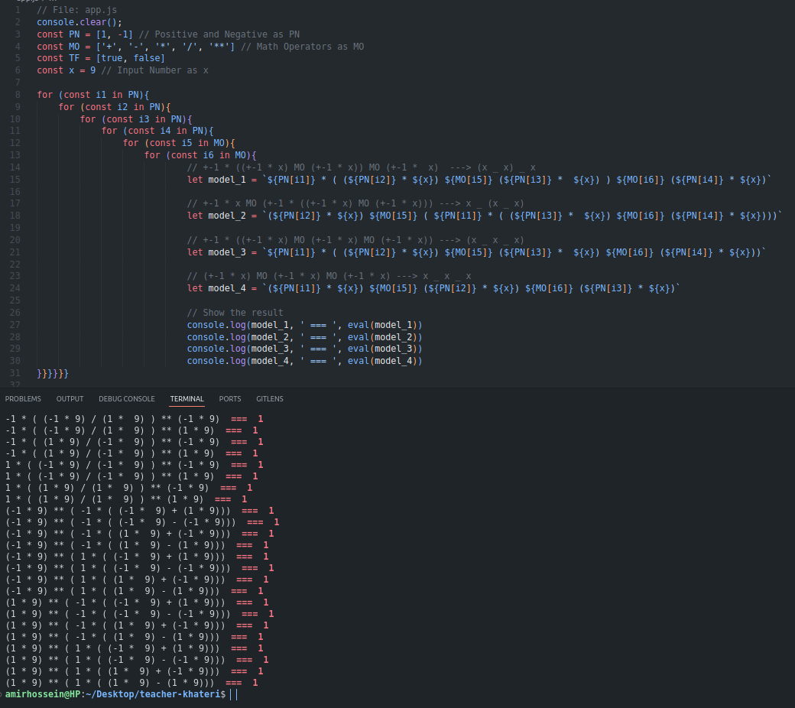

# Solve a Numeric Puzzle: 9 9 9 = 1
**Description**: To solve this puzzle, you have to put 3 numbers 9 between the mathematical operators so that the final answer is one.<br>
This project was supposed to be solved manually and like a simple puzzle, although some friends used artificial intelligence to solve the challenge, but it occurred to me to solve this puzzle by using a programming language, whether Python or JavaScript.
```js
9 _ 9 _ 9 = 1 // How?
```
## Answer

#### Some seemingly correct but wrong answers
```js
1. ( 9 - 9 ) ** 9
2. ( 9 ** ( 1 / 2 )) * ( 9 ** ( 1 / 2 )) / 9
3. 9 && 9 / 9
4. ( 9 ** 0 ) * 9 / 9

// Correct answer
5. 9 ** 9 - 9
```

#### My Answer
```js
// File: app.js
console.clear();
const PN = [1, -1] // Positive and Negative as PN
const MO = ['+', '-', '*', '/', '**'] // Math Operators as MO
const x = 9 // Input Number as x

for (const i1 in PN) {
    for (const i2 in MO){
        for (const i3 in PN) {
            for (const i4 in MO) {
                for (const i5 in PN) {
                    let result = `(${PN[i1]} * ${x}) ${MO[i2]} (${PN[i3]} * ${x}) ${MO[i4]} (${PN[i5]} * ${x})`
                    console.log(result, ' --- ', eval(result), eval(result).toFixed())
                }
            }
        }
    }
}

// Bash Terminal
const terminalCommand = "node app.js | grep -E '1$' | grep ' 1'"
```

## Visual Report
**Trying to get all states manually into an array in Python.**<br>
<a href="./assets/images/hard-working.png" ></a>

**After many and useless attempts to guess all the states, I tried to solve this problem with a new method.**<br>
<a href="./assets/images/whiteboard.jpg" ></a>

**And finally I got the desired answer**<br>
<a href="./assets/images/code-result.png" ></a>