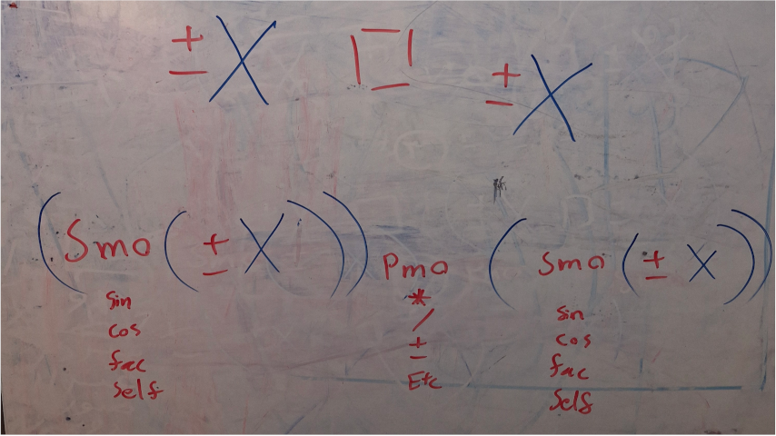

# Version 2 (Solve a Numeric Puzzle: 0 0 0 = 6)
**Date-Start**: 1403,05,13 - 2024,08,03 
**Date-End**: 1403,05,14 - 2024,08,04 
**Live**: [🖥️](https://amirhossein-github.github.io/teacher-khateri/side-projects/numericPuzzle/version/v2/) 
**Description**: In this version, I started from the beginning and designed the two-number mode of this puzzle, that is: **`X1 (Math Operation) X2`**. In this section, I added more operations and made the necessary preparations for the three-digit mode.

- 🟢 This version supports the following math operations:
    - Addition
    - Subtraction
    - Multiplication
    - Division
    - Power
    - Root
    - Sine
    - Cosine
    - Factorial

- 🔴 The output of the program is very large and makes it difficult to read.
- 🔴 It has not been fully tested and may have calculation errors in certain cases.

## Visual Report
**After many and useless attempts to guess all the states, I tried to solve this problem with a new method.** 
