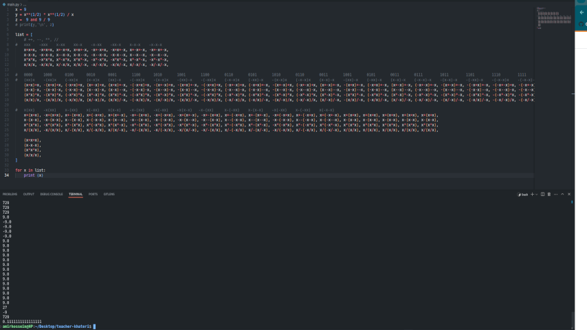
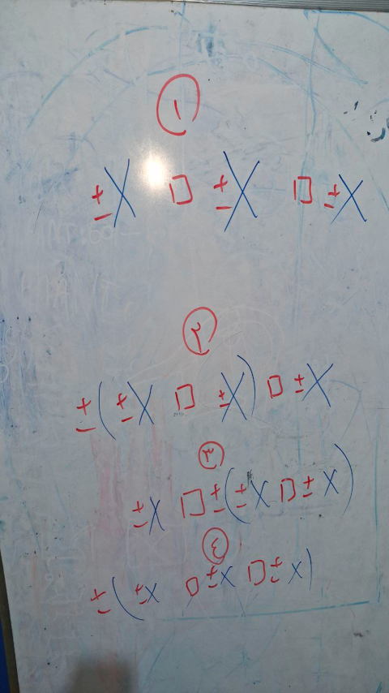
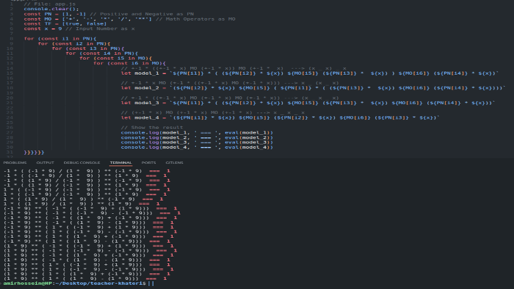
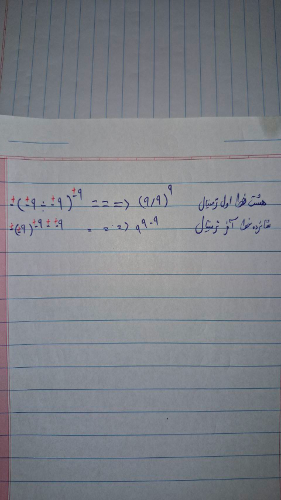

# Version 1 (Solve a Numeric Puzzle: 9 9 9 = 1)
**Date-Start**: 1403,05,12 - 2024,08,02<br>
**Date-End**: 1403,05,13 - 2024,08,03<br>
**Live**: [🖥️](https://amirhossein-github.github.io/teacher-khateri/side-projects/puzzle1/version/v1/index.html)<br>
**Description**: To solve this puzzle, you have to put 3 numbers 9 between the mathematical operators so that the final answer is one.<br>
This project was supposed to be solved manually and like a simple puzzle, although some friends used artificial intelligence to solve the challenge, but it occurred to me to solve this puzzle by using a programming language, whether Python or JavaScript.
```js
9 _ 9 _ 9 = 1 // How?
```
## Answer

#### Some seemingly correct but wrong answers
```js
1. ( 9 - 9 ) ** 9
2. ( 9 ** ( 1 / 2 )) * ( 9 ** ( 1 / 2 )) / 9
3. 9 && 9 / 9
4. ( 9 ** 0 ) * 9 / 9

// Correct answers
5. 9 ** 9 - 9
6. (9 / 9) 9
```

## Visual Report
**Trying to get all states manually into an array in Python.**<br>
<a href="./assets/images/hard-working.png" ></a>

**After many and useless attempts to guess all the states, I tried to solve this problem with a new method.**<br>
<a href="./assets/images/whiteboard.png" ></a>

**And finally I got the desired answer**<br>
<a href="./assets/images/code-result.png" ></a>
<a href="./assets/images/result-description.png" ></a>