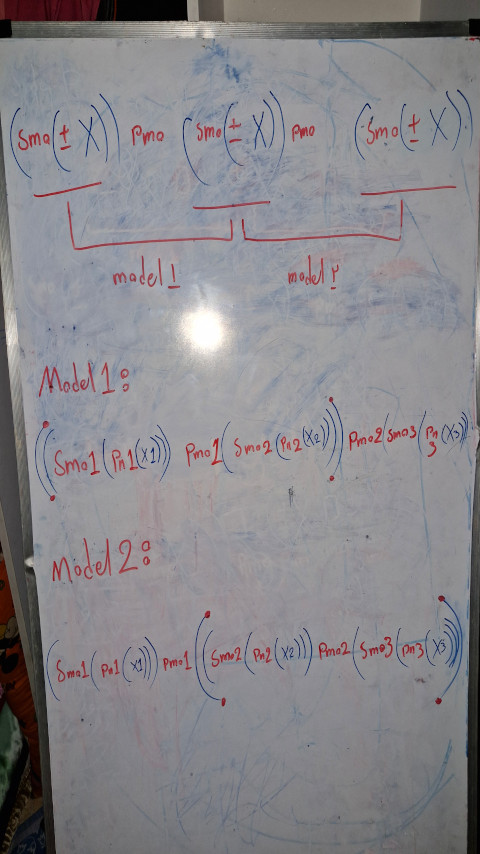

# Version 3
**Date-Start**: 1403,05,13 - 2024,08,03 
**Date-End**: 1403,05,15 - 2024,08,05 
**Live**: [🖥️](https://amirhossein-github.github.io/teacher-khateri/side-projects/puzzle1/version/v3/index.html) 
**Description**: In this version, I used what I learned from version two and redesigned version one, which was a 3-person mode. **`X1 (Math Operation) X2 (Math Operation) X3`**

- 🔴 The output of the program is very large and makes it difficult to read.
- 🔴 It has not been fully tested and may have calculation errors in certain cases.

## Visual Report
**Implementation idea.** 
